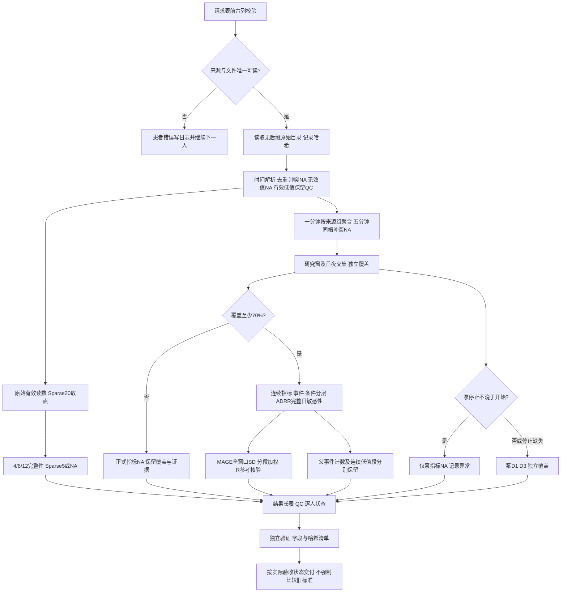

# 数据处理及异常路径

```mermaid
flowchart TD
 A[请求表前六列校验] --> B{来源与文件唯一可读?}
 B -->|否| X[患者错误写日志并继续下一人]
 B -->|是| C[读取无后缀原始目录 记录哈希]
 C --> D[时间解析 去重 冲突NA 无效值NA 有效低值保留QC]
 D --> S[原始有效读数 Sparse20取点]
 S --> S2[4/8/12完整性 Sparse5或NA]
 D --> T[一分钟按来源组聚合 五分钟同槽冲突NA]
 T --> W[研究窗及日夜交集 独立覆盖]
 W --> Q{覆盖至少70%?}
 Q -->|否| N[正式指标NA 保留覆盖与证据]
 Q -->|是| M[连续指标 事件 条件分层 ADRR完整日敏感性]
 M --> G[MAGE全窗口SD 分段加权 R参考核验]
 W --> P{泵停止不晚于开始?}
 P -->|是| PN[仅泵指标NA 记录异常]
 P -->|否或停止缺失| PF[泵D1 D3 独立覆盖]
 M --> E[父事件计数及连续低值段分别保留]
 S2 --> O[结果长表 QC 逐人状态]
 N --> O
 G --> O
 PF --> O
 PN --> O
 E --> O
 O --> V[独立验证 字段与哈希清单]
 V --> Z[按实际验收状态交付 不强制比较旧标准]
```

北京时间；普通日期补00:00，泵开始日期补12:00。研究窗左闭右开。0/负值/确认错误码为NA，有效正值低于1.8保留并标记。NA及缺口断开事件。
